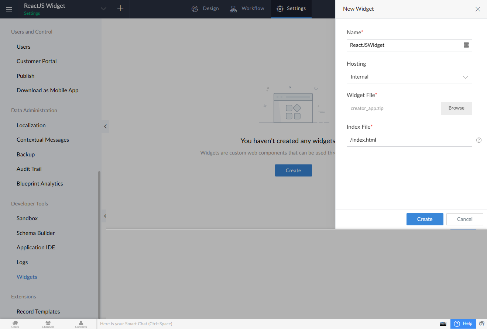
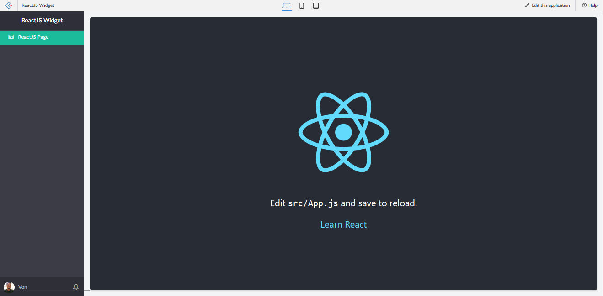

# Zoho Creator Starter Template Widget built with React JS

## Requirements ! MUST HAVE !!

1. First, make sure you have all requirements to create simple zoho creator widget, please refer to this article https://www.zoho.com/creator/newhelp/app-settings/widgets/install-cli.html.

```
npm install -g zoho-extension-toolkit
```

2. Then, clone the repository

```
git clone https://github.com/vjbautista8/zoho-creator-widget-starter-template-reactJS.git
```

2. To install dependencies in `creator_app` folder, change the directory of cmd to `/creator_app`, then run the following command;

```
npm install
```

3. To install dependencies in `react_app` folder, change the directory of cmd to `/react_app`, then run the following command;

```
npm install
```

## How to run locally

1. In your cmd, make sure your command path is `/react_app`, then run the following command

```
npm start
```

2. Edit the code like normal React JS application.

## How to build and deploy to Zoho Creator

1. Build your application. Make sure your directory in cmd is `/react_app` folder, then run the following command

```
npm run build
```

2. Go to `/creator_app/dist` folder, you will find `creator_app.zip`.
3. Go to your Zoho Creator account > Settings > Widgets , and add new widget

- Name : Anything you want
- Hosting : Internal
- Widget File : creator_app.zip
- Index File : /index.html
  

7. Then, you are good to go. use the widget in Zoho Creator Pages.
   

## Hope this will help you !
